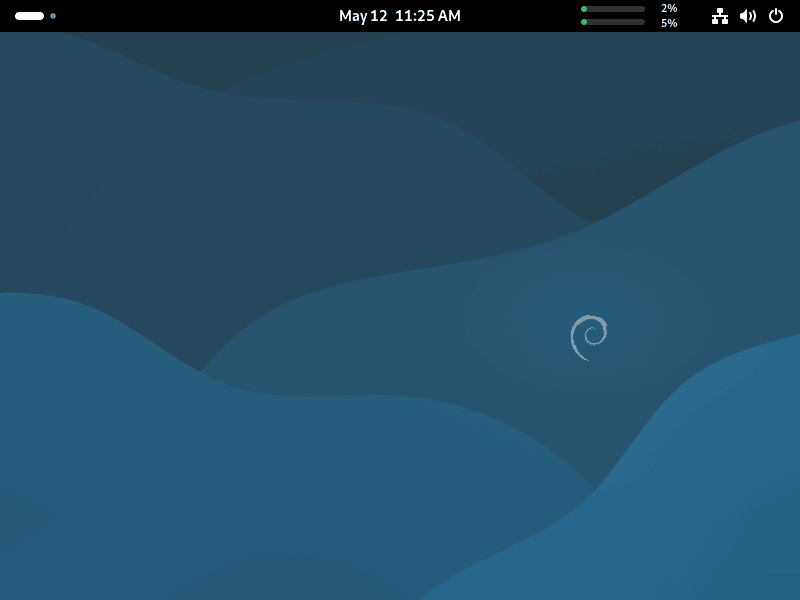
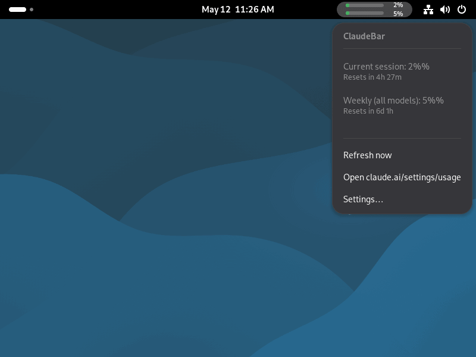
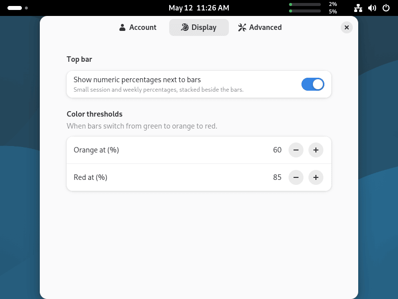
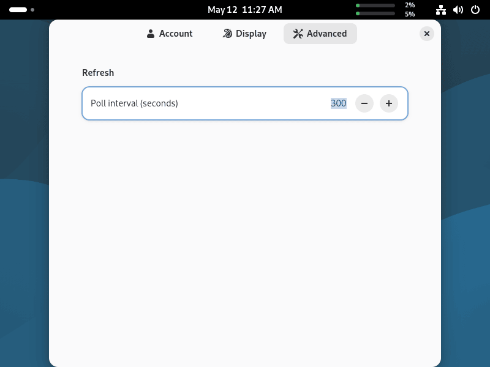
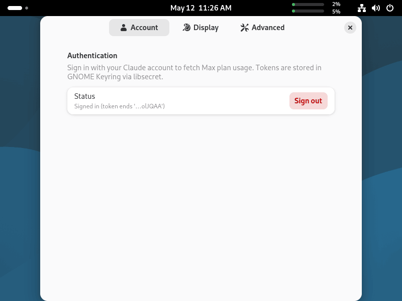

# ClaudeBar on GNOME (Debian/Ubuntu)

Screens of the ClaudeBar GNOME Shell extension, captured on Debian.

### Desktop

### Pop-up menu

### Display settings

### Advanced settings

### Account settings

