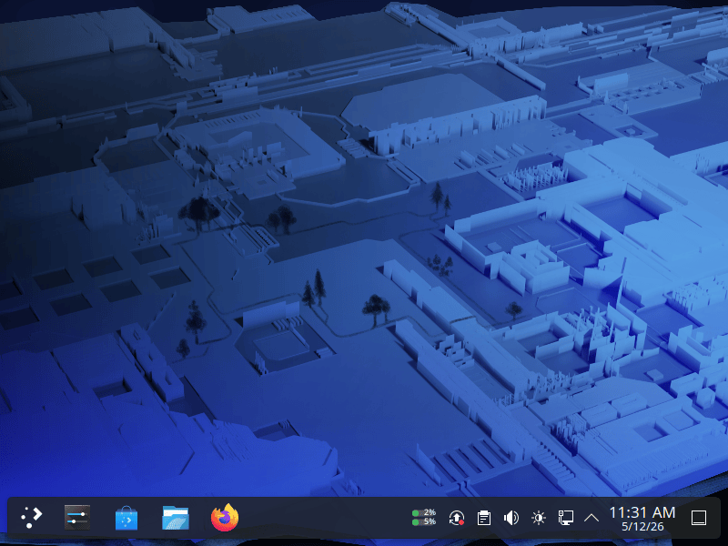
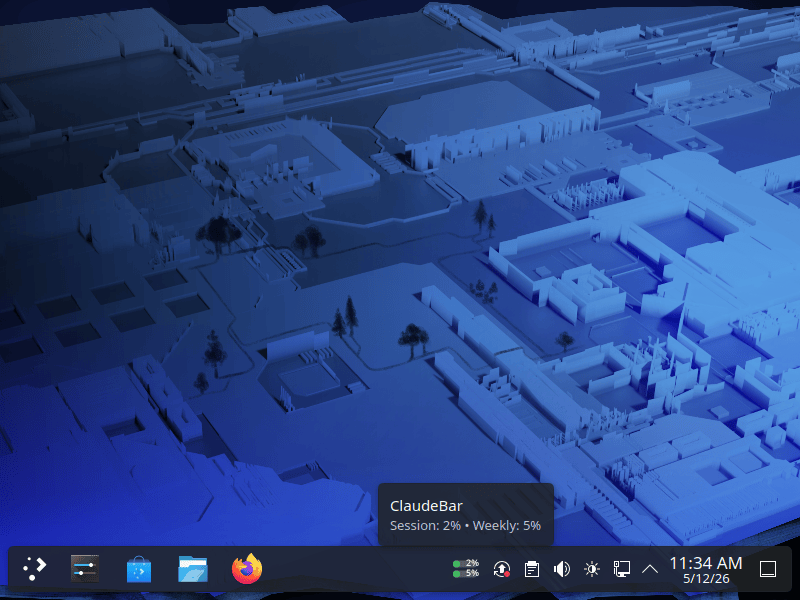
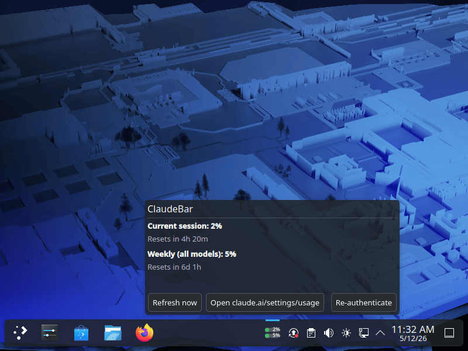
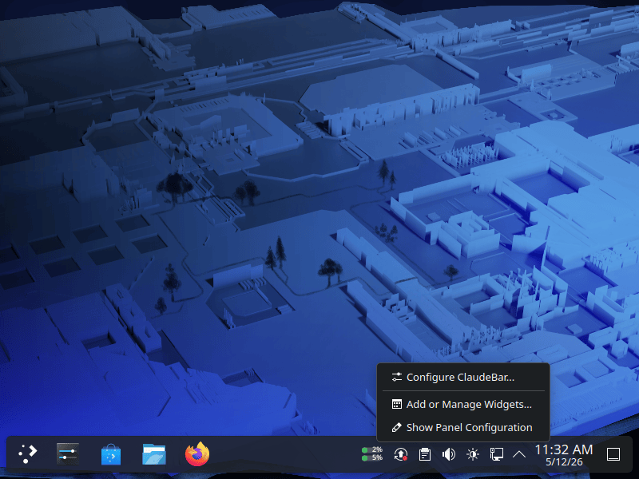
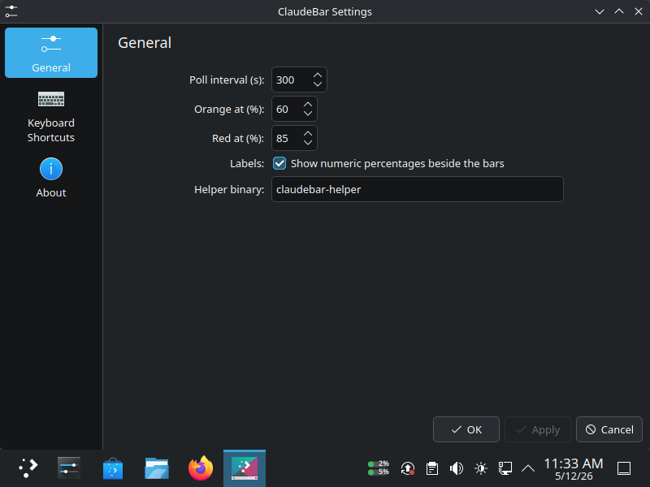

# ClaudeBar on KDE Plasma (Fedora)

Screens of the ClaudeBar KDE Plasma applet, captured on Fedora.

### Desktop

### Hover tooltip

### Pop-up menu

### Right-click menu

### General settings

