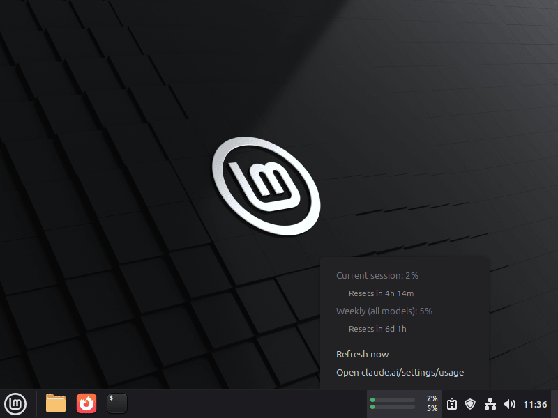
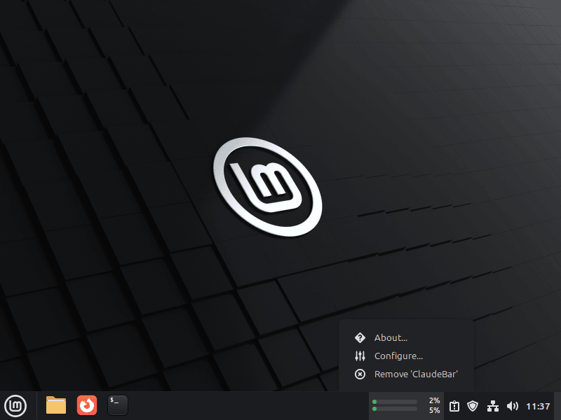
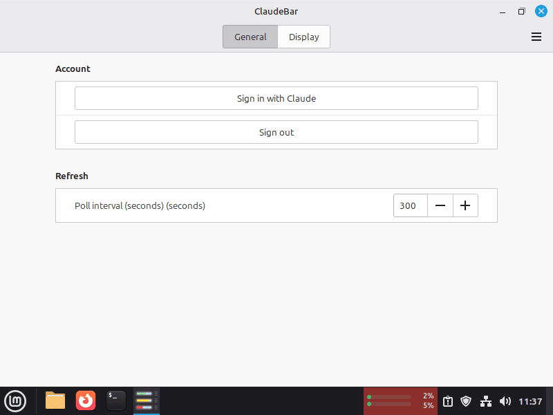
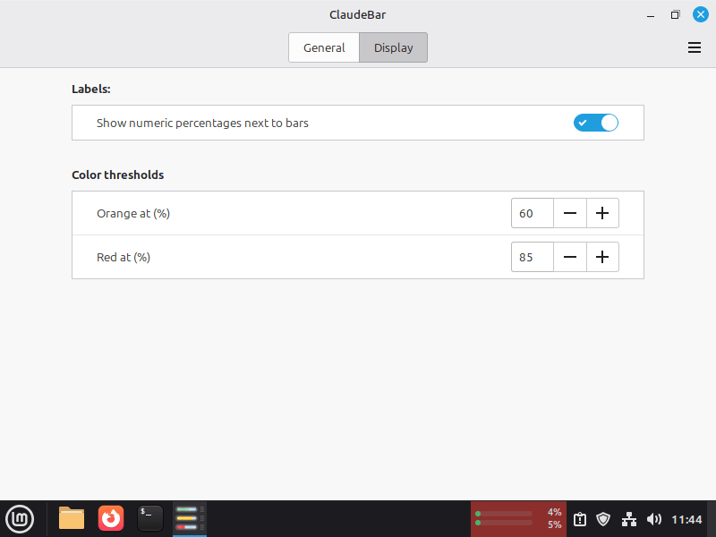

# ClaudeBar on Cinnamon (Linux Mint)

Screens of the ClaudeBar Cinnamon applet, captured on Linux Mint.

### Desktop

### Pop-up menu

### Right-click menu

### General settings

### Display settings

